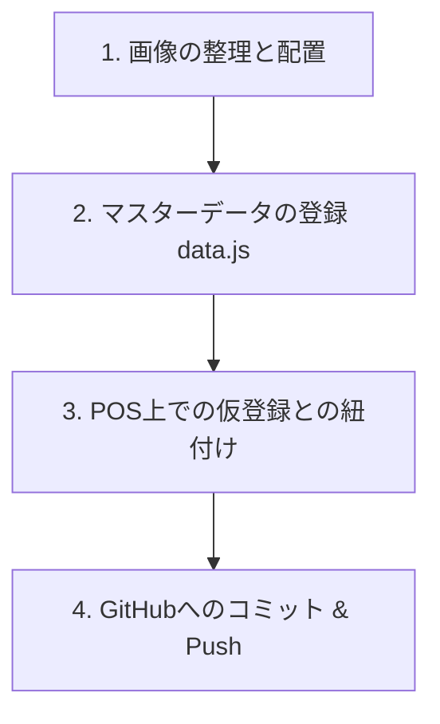

# 🗿 新規作品の登録・POS連携手順マニュアル

このマニュアルは、スタジオで撮影・加工された画像を使用して、新規作品をお品書き（カタログ）に登録し、POSシステムと連携して公開・同期するまでの一連の流れをまとめたものです。

---

## 📋 全体フロー図



---

## 1. 画像の整理と配置

撮影会場から出力された画像を適切なフォルダに格納し、リネームします。

### ① メイン画像（カバー画像）の配置
- **配置先**: `images/kurima/` 直下
- **命名規則**: `[作品の英語ID].jpg` (または `.png`)
  - *例*: `images/kurima/machoi_moai_lure_stand.jpg`

### ② サブ画像（詳細画像群）の配置
- **配置先**: `images/kurima/[作品の英語ID]/` (フォルダを新規作成)
- **ファイル移動**: `スタジオモアイ\撮影会場\` に書き出された複数の `_studio.png` 画像を、この作成したフォルダに移動します。
  - *例*: `images/kurima/machoi_moai_lure_stand/IMG_0841_studio.png`

---

## 2. マスターデータの登録 (`data.js`)

カタログとPOSのベースとなる [data.js](file:///C:/dev/moaigame3D%20-%20%E3%82%B3%E3%83%94%E3%83%BC/data.js) に作品データを追加します。

1. [data.js](file:///C:/dev/moaigame3D%20-%20%E3%82%B3%E3%83%94%E3%83%BC/data.js) をエディタで開きます。
2. `MASTER_PRODUCTS` 配列の末尾に、以下の形式でデータを追加します。

```javascript
  {
    id: 'moai_lure_stand', // ★ Firebaseと紐付ける一意のID (画像リネーム前と一致させておくと安全)
    image: 'images/kurima/machoi_moai_lure_stand.jpg', // ★ メイン画像パス
    images: [
      'images/kurima/machoi_moai_lure_stand.jpg', // ★ 詳細サムネイルに表示する画像群 (メイン画像も含む)
      'images/kurima/machoi_moai_lure_stand/IMG_0841_studio.png',
      'images/kurima/machoi_moai_lure_stand/IMG_0843_studio.png',
      // ... 他のサブ画像をすべて記述
    ],
    name:  'まちょいモアイルアースタンド', // ★ カタログに表示する正式な作品名
    desc:  'モアイがあなたの大切なルアー（釣具）をがっちりホールドする専用スタンド。' // ★ 説明文
  },
```

---

## 3. POS上での仮登録（シミュレーションデータ）との紐付け

あらかじめPOS画面の「開発作品」として仮登録してあった金額やシミュレーション数を、新しく本登録したデータとマージします。これにより、**金額の再入力やシミュレーション数の打ち直しが不要**になります。

1. `pos.html` をブラウザで開き、ログインします。
2. 出品作品選択のグリッドにある、表示の壊れている（または古い名前の）仮登録カードの **「✨ (進捗更新)」ボタン** をクリックします。
3. ポップアップが表示されます。
4. **「本登録作品と紐付ける (マージ)」** のプルダウンから、手順2で登録した正式な作品名（例: `まちょいモアイルアースタンド`）を選択します。
5. **「更新する！」** をクリックします。
   - これで画像と名前が正式なものに一瞬で切り替わり、金額データ等はそのまま引き継がれます。

---

## 4. GitHubへのコミット & Push（同期）

変更したファイルをコミットし、本番環境に反映します。

1. コマンドプロンプトやVSCode等のターミナルを開きます。
2. 以下のコマンドを実行して、追加した画像とコードをコミットします。

```bash
# 1. 変更ファイルのステージング
git add data.js pos.html images/kurima/

# 2. コミット
git commit -m "feat: Register [作品名] and link with POS"

# 3. リモートの最新情報を取得（競合回避のため）
git pull origin main

# 4. リモートリポジトリへ反映
git push origin main
```

---

> [!TIP]
> **「AIにすべて任せる」場合**:
> 自分でやるのが面倒な場合は、AI（Antigravity）チャット欄に「〜のメイン画像とサブ画像を整理して、data.jsに登録して、GitでPushして」と一言指示を投げるだけで、AIがすべてのファイルを裏で移動し、`data.js` や `pos.html` の更新、Git Pushまで全自動で行います。
